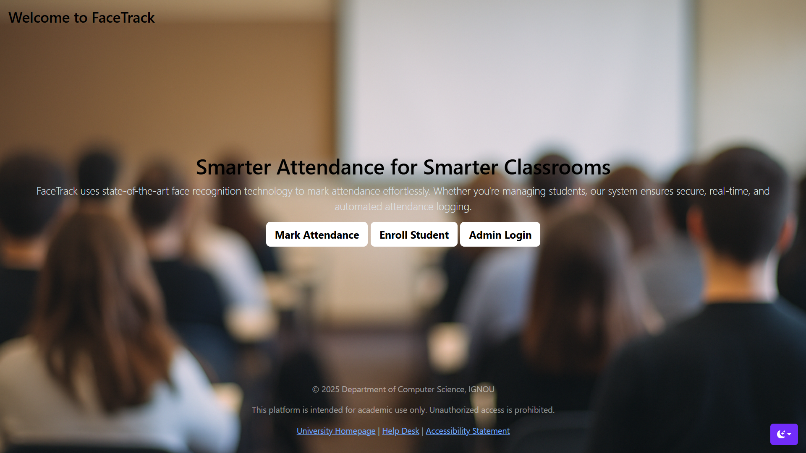
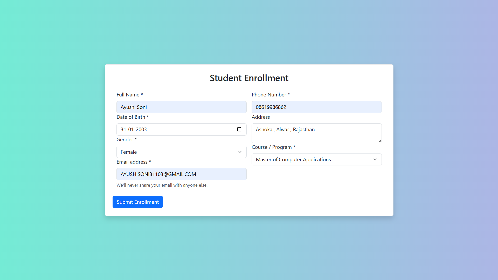
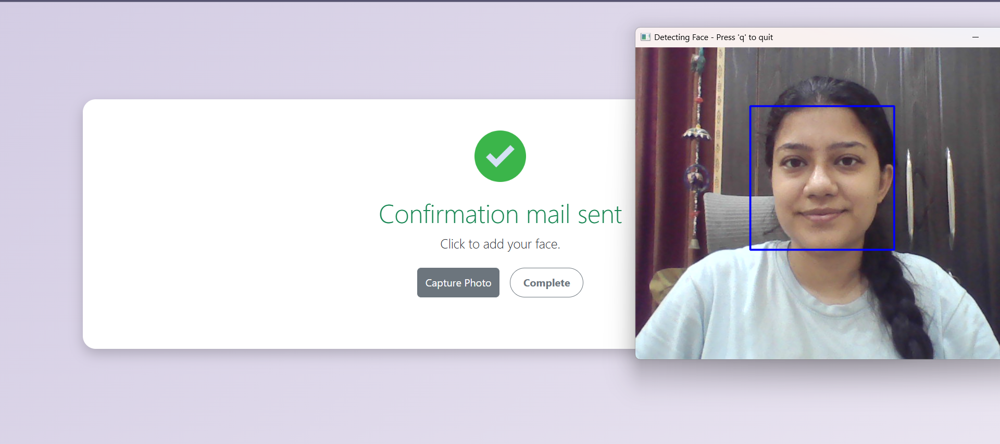
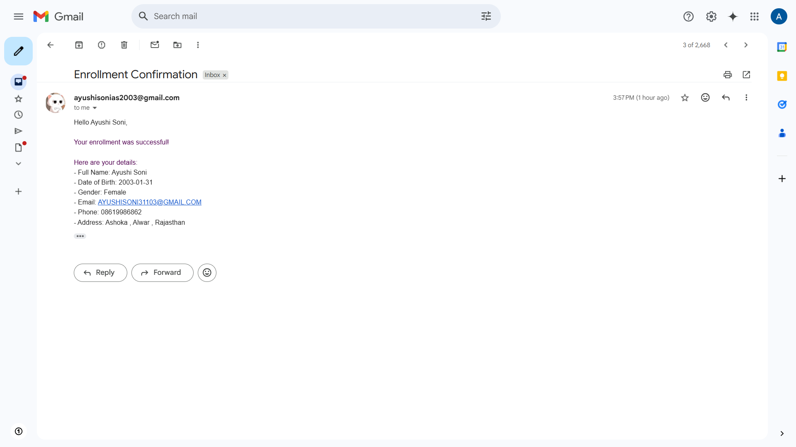
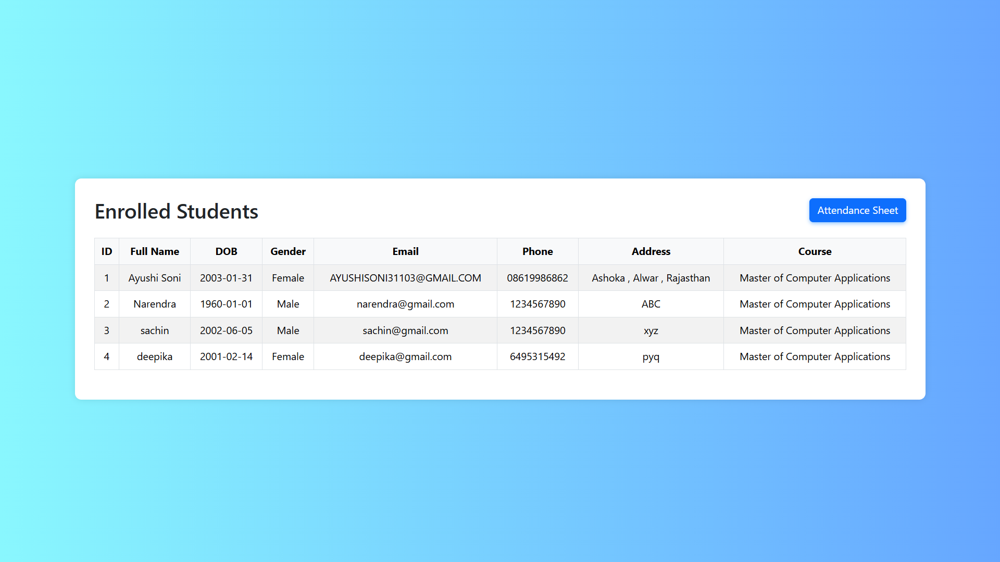
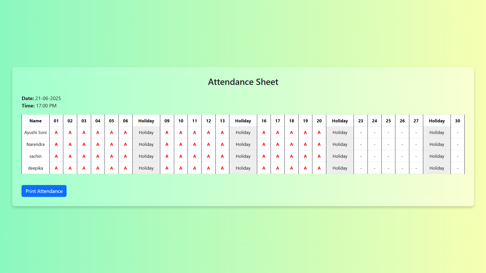

# Face Recognition Attendance System

This project is a **Face Recognition Based Attendance System** built using Python and Flask. It uses a webcam to detect and recognize faces and automatically marks attendance for recognized individuals.

## 🔧 Features

- Real-time face detection via webcam
- Attendance recording 
- Database integration using SQLAlchemy
- Email notifications for successful enrollments
- User-friendly web interface with Flask
- Admin panel to view records and attendance

---

## 📸 Screenshots

### 🏠 Homepage
> A welcoming dashboard for admins and users.



---

### 👤 New Student Enrollment Form
> Add new students to the system with face data.



---

### 📷 Live Face Detection
> Real-time face recognition from webcam feed.



---

### 📨 Email Confirmation Message
> Email sent to student after successful enrollment.



---

### 📅 Enrollments Records View
> Shows all enrolled students.



---

### 📅 Attendance View
> Shows all students and their attendance.



---

## ⚙️ Technologies Used

- Python
- Flask
- OpenCV
- face_recognition library
- SQLAlchemy
- SMTP for Email (Flask-Mail)

---

## 🚀 Getting Started

**1. Clone the Repository**

```bash
[git clone https://github.com/your-username/face-recognition-attendance.git](https://github.com/AyushiSoni2003/face-recognition-attendance-system.git)
cd face-recognition-attendance

**2. Install Requirements**

pip install -r requirements.txt

**3. Run the Application**

python app.py

**4. Access it**

Open your browser and go to http://127.0.0.1:5000/.

## ✅ How Attendance Works
- Launch the app , enroll student and capture image 

- Confirmation email is sent to the student

- System detects and recognizes faces

- On match, attendance is marked in the database

- login as admin , and see enrolled students and attendance sheet

## 📬 Email Feature
On successful enrollment, students receive an email with their registration details. 

## 📌 TODO
- Add user authentication

- Improve UI design

- Store attendance data in cloud

##🤝 Contributing
Pull requests are welcome. For major changes, please open an issue first to discuss what you would like to change.

##📃 License
MIT License
