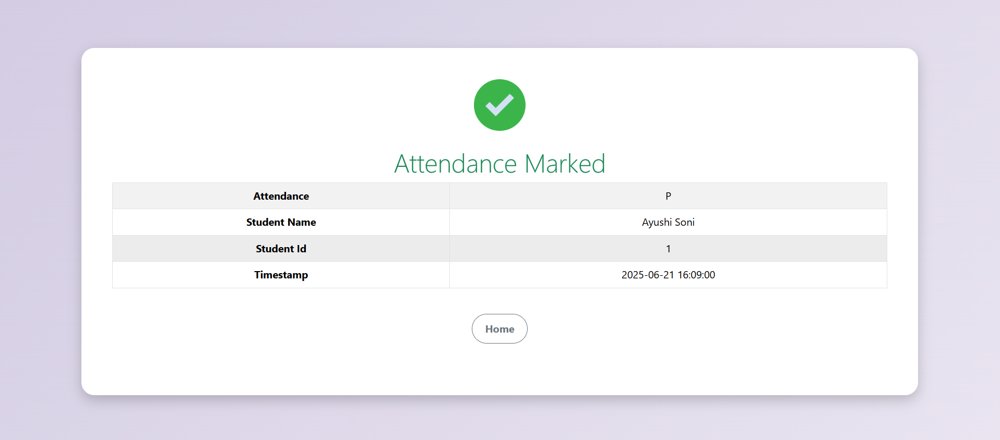

# 🎯 Face Recognition Attendance System

A real-time face recognition-based attendance system using **Python**, **OpenCV**,**face_recognition** and **Flask**. Designed for educational and organizational use.

---

## 📌 Features

- Face Detection and Recognition using Webcam
- Automatic Attendance Recording
- Student Enrollment and face Capturing with Email Notification
- View Enrolled Students and Attendance Records
- Simple Flask-based Web UI

---

## 🖼️ Screenshots

### 🏠 Homepage


### 👤 New Student Enrollment Form


### 📷 Live Face Detection


### 📨 Email Confirmation Message


### 📅 Attendance Marked View


### 📅 Admin Login Page


### 📅 Enrolled Students View


### 🗑️ Attendance Sheet View


---

## 🗂️ Project Structure

```
Face Recognition Attendance System/
├── app.py
├── templates/
├── static/
├── face_recognition/
├── screenshots/    
├── database.db
├── README.md
└── requirements.txt
```

---


## ✅ How Attendance Works

1. Launch the app and enroll the student
2. A confirmation email is sent to the student
3. capture image and recognizes faces in real-time
4. On match, attendance is automatically recorded in the database
5. Admin can view enrolled students and attendance sheet


---

## 📬 Email Feature

On successful enrollment, students receive an email with their registration details.  
Make sure to configure your Flask-Mail settings as follows:

```python
app.config['MAIL_SERVER'] = 'smtp.gmail.com'
app.config['MAIL_PORT'] = 587
app.config['MAIL_USERNAME'] = 'your-email@gmail.com'
app.config['MAIL_PASSWORD'] = 'your-password'
app.config['MAIL_USE_TLS'] = True
app.config['MAIL_USE_SSL'] = False
```

> 🛡️ **Note:** It's highly recommended to use environment variables for email credentials in production.


---


## 🚀 Getting Started

1. **Clone the Repository**

```bash
git clone https://github.com/AyushiSoni2003/face-recognition-attendance-system.git
cd face-recognition-attendance
```

2. **Install Requirements**

```bash
pip install -r requirements.txt
```

3. **Run the Application**

```bash
python app.py
```

4. **Access it**

Open your browser and go to:  
[http://127.0.0.1:5000/](http://127.0.0.1:5000/)

---


## 📬 Email Feature

On successful enrollment, students receive an email with their registration details.

---


## 📌 TODO

- [ ] Add user authentication system (Admin / Staff roles)
- [ ] Improve frontend UI/UX
- [ ] Store attendance data on the cloud

---

## 🤝 Contributing

Pull requests are welcome!  
For major changes, please open an issue first to discuss what you'd like to change.

---

## 📃 License

This project is licensed under the **MIT License**.  
Feel free to use, modify, and distribute.

---
